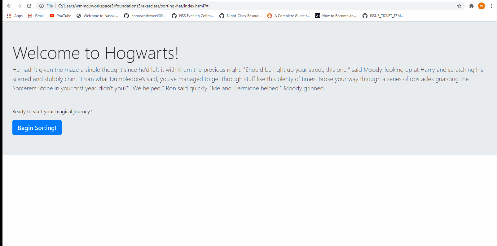

# sorting-hat
This app was built as a study group assignment during my time at Nashville Software School. Each individual created an app but collaboratively brainstormed and discussed challenges we encountered. The assignment incorporates HTML, CSS, and JavaScript as well as GitHub. The goal was to create a "sorting hat" based on the Harry Potter series. The project incorporates JavaScript functions and methods such as printing to the DOM and targeting elements by class and/or id. The user is able to click a button that generates a form. The user can input information in the form, click 'sort,' and be randomly assigned a house. Using an "expel" button was another challenge we were tasked with. 

#Demo

